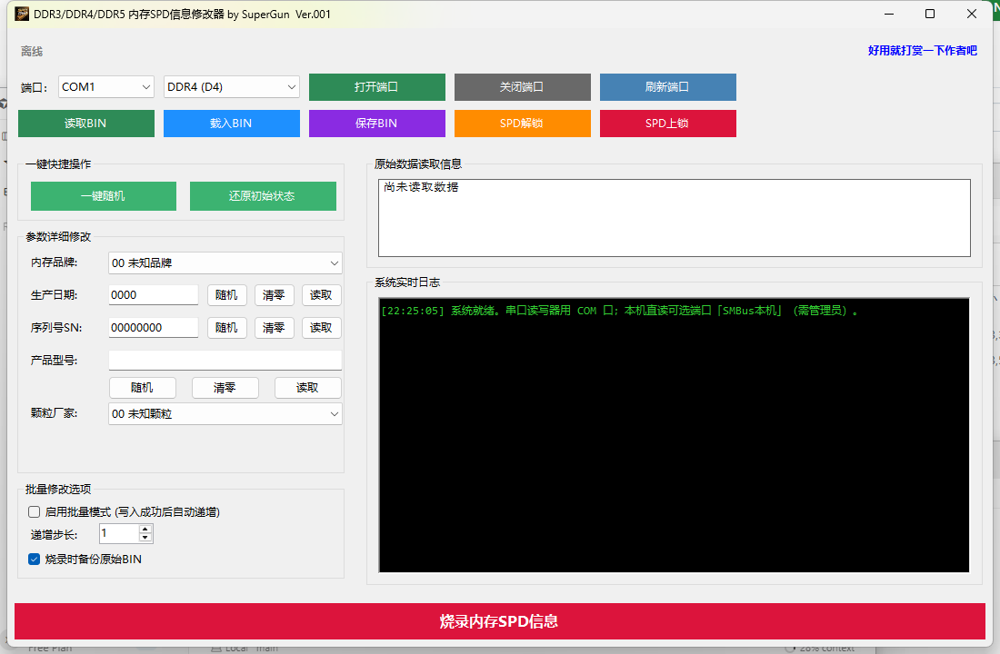

# MemorySpdEdit Pro · 内存SPD修改工具 Pro

Windows 桌面端 DDR3 / DDR4 / DDR5 内存 **SPD** 读写与编辑工具（当前 **Ver26.38.0002**），作者 SuperGun。

支持：
- [spdrw](https://github.com/spdrw/spdrw.github.io) 文本串口协议
- [1a2m3/SPD-Reader-Writer](https://github.com/1a2m3/SPD-Reader-Writer) Arduino 二进制协议（自动探测）
- **本机 SMBus 只读**（经 [RAMSPDToolkit](https://github.com/Blacktempel/RAMSPDToolkit) + WinRing0 / PawnIO）

欢迎 Star / Fork / Issue。

## 版本号规则

格式：`Ver` + 年度后 2 位 + `.` + ISO 周度（2 位）+ `.` + 流水号（4 位）

示例：`Ver26.38.0002`（2026 年第 38 周，本周第 2 次发布）

- **仅在**向 GitHub **推送发布打包程序**时递增（`scripts/Publish-Release.ps1`）
- 同一年周内流水号 +1；跨周则流水从 `0001` 起
- 变更后写入 `Version.props`，并同步推送到 GitHub 源码仓库

## 下载

正式发布页：**[Releases](https://github.com/hbsyth/MemorySpdEdit-Pro/releases)**（最新标签形如 `Ver26.38.0002`）

推荐下载 **不包含依赖的单一文件** ZIP：`MemorySpdEdit-Pro-VerYY.WW.NNNN.zip`（解压后运行 `MemorySpdEdit-Pro-VerYY.WW.NNNN.exe`，需已安装 .NET 10 Desktop Runtime x64；包内不含运行时）。

使用本机 SMBus 读取 SPD 时，请右键程序「以管理员身份运行」。

## 程序截图



## 功能

- COM 串口连接 SPD 读写器（115200）：读取 / 烧录 / 解锁 / 上锁
- **端口下拉可选「SMBus本机」**：直接读取主板上内存条 SPD（只读，需管理员）
- 载入 / 保存 BIN
- 修改内存品牌、颗粒厂家、序列号、产品型号、生产日期
- 一键随机、还原初始状态
- 批量模式：写入成功后 SN 自动递增
- 烧录前：参数无变更则跳过；检测写保护；可选备份原始 BIN
- 实时操作日志

## SMBus 使用说明

1. **右键 → 以管理员身份运行**本程序  
2. 端口选择 **SMBus本机** → 打开端口 → 读取 BIN  
3. 烧录 / 解锁 / 上锁仍须改用 COM 外置读写器  

**驱动**：程序已内置官方签名版 [PawnIO](https://pawnio.eu) 安装包（`PawnIO_setup.exe`）。打开 SMBus 时：

- **已安装 PawnIO** → 直接连接  
- **未安装** → 弹窗提示，确认后静默安装；若返回需重启则重启后再用  

若 PawnIO 仍不可用，会回退尝试 WinRing0（可能被「内存完整性」拦截）。部分笔记本 BIOS 可能限制 SMBus 探测。

**说明**：可插拔 SODIMM/UDIMM 一般可读；笔记本焊接板载 LPDDR 往往不经标准 SMBus 暴露 SPD，此时软件无法直读（属硬件限制，非程序故障）。

## 运行

```powershell
dotnet run --project SpdEditor.csproj
```

单文件自包含发布：

```powershell
dotnet publish SpdEditor.csproj -c Release -r win-x64 -o .\publish
```

产物：`publish\MemorySpdEdit-Pro.exe`（一个文件即可拷贝运行）。

框架依赖单一文件（文件名含版本号；**不包含** .NET 运行时依赖，需已安装 .NET 10 Desktop Runtime x64）：

```powershell
powershell -ExecutionPolicy Bypass -File .\launcher\publish-minimal.ps1
```

产物：`publish\minimal\MemorySpdEdit-Pro-VerYY.WW.NNNN.exe`（一个文件即可拷贝运行）。

正式发布打包（升版本 → 构建 → ZIP → 推送源码 → GitHub Release）：

```powershell
powershell -ExecutionPolicy Bypass -File .\scripts\Publish-Release.ps1
```

说明：.NET 单文件首次启动可能略慢；已关闭单文件压缩与 R2R，并避免启动时解压 PawnIO 安装包。烧录备份默认写在该 exe 所在目录。

## 硬件

- **串口模式**：需 SPD 读写器（CH341 / Pico / Arduino 固件等）
- **SMBus 模式**：无需外置硬件，直接读本机插槽

spdrw 帧格式：

```
AA 55 [cmd] [deviceType] [addrHi] [addrLo] 00 [data] [crc8]
```

## 项目结构

```
Core/
  SpdProtocol.cs         - spdrw 串口协议
  SpdArduinoProtocol.cs  - Arduino 固件协议常量
  SpdArduinoDevice.cs    - Arduino 读写 / RSWP
  SmbusSpdService.cs     - 本机 SMBus 只读
  SerialDeviceService.cs - COM 通信
  SpdParser.cs           - SPD 解析
  SpdEditorLogic.cs      - 字段写回与 CRC
  SpdUtils.cs            - CRC 与时序换算
  JedecManufacturers.cs  - JEP106 制造商表
Assets/                  - 应用图标、收款码等资源
docs/                    - 截图与说明资源
MainForm.* / Program.cs
```

## 第三方许可

- RAMSPDToolkit：MPL 2.0（含 WinRing0）
